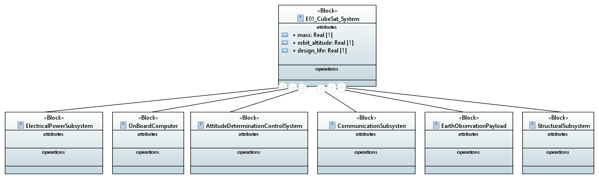

# MBSE CubeSat Mission — EO-1 Earth Observation Satellite

> A complete **Model-Based Systems Engineering (MBSE)** model of a 2U CubeSat Earth observation mission, developed using SysML 1.6 and PlantUML. This project demonstrates the full SE process from mission requirements through system architecture, subsystem decomposition, interface definition, behavioural modelling, and parametric analysis.

---

## 📐 About This Project

**Mission:** EO-1 is a 2U CubeSat operating at 550 km LEO designed to capture multispectral Earth observation imagery at ≤10 m ground sampling distance.

This model was built to demonstrate SysML-based systems engineering methodology across all nine canonical diagram types, applied to a realistic space-systems problem.

**Tools Used:**
- [PlantUML](https://plantuml.com) — text-based SysML/UML diagrams
- SysML 1.6 stereotypes and notation conventions
- Compliant with INCOSE Systems Engineering Handbook v4 and NASA SE Handbook SP-2016-6105

---

## 🗂️ Model Structure

```
mbse-cubesat-mission/
├── diagrams/
│   ├── 01_bdd_cubesat_system.puml        ← Block Definition Diagram
│   ├── 02_ibd_cubesat_interfaces.puml    ← Internal Block Diagram
│   ├── 03_req_cubesat_requirements.puml  ← Requirements Diagram
│   ├── 04_uc_cubesat_use_cases.puml      ← Use Case Diagram
│   ├── 05_act_mission_timeline.puml      ← Activity Diagram
│   ├── 06_seq_data_downlink.puml         ← Sequence Diagram
│   ├── 07_stm_satellite_modes.puml       ← State Machine Diagram
│   ├── 08_par_power_budget.puml          ← Parametric Diagram
│   └── 09_pkg_system_decomposition.puml  ← Package Diagram
└── README.md
```

---

## 📊 SysML Diagrams

### 1. Block Definition Diagram (BDD)
Defines the EO-1 system hierarchy — all six subsystems (EPS, OBC, ADCS, COMMS, Payload, Structure) with their properties, values, and operations.



---

### 2. Internal Block Diagram (IBD)
Shows the internal interfaces and data/power flows between subsystems — power bus, command bus, telemetry, and image data paths.

> 📁 [View source](diagrams/02_ibd_cubesat_interfaces.puml)

---

### 3. Requirements Diagram (REQ)
Eight system-level requirements derived from the mission objective, with satisfy relationships mapped to responsible subsystem blocks.

| ID | Requirement | Subsystem |
|----|-------------|-----------|
| REQ-001 | Capture Earth observation images from 550 km LEO | System |
| REQ-002 | Ground sampling distance ≤ 10 m | Payload |
| REQ-003 | Nadir pointing accuracy ≤ 0.1° | ADCS |
| REQ-004 | Supply ≥ 5W continuous during sunlit phase | EPS |
| REQ-005 | Downlink ≥ 50 MB per ground pass | COMMS |
| REQ-006 | Operate nominally for ≥ 1 year | System |
| REQ-007 | Total mass ≤ 2.0 kg | System |
| REQ-008 | Execute ground commands within 10 seconds | OBC |

> 📁 [View source](diagrams/03_req_cubesat_requirements.puml)

---

### 4. Use Case Diagram (UC)
Mission use cases including image capture, telemetry downlink, command execution, safe mode entry, and power generation — with actors (Mission Operator, Ground Station, End User, Sun).

> 📁 [View source](diagrams/04_uc_cubesat_use_cases.puml)

---

### 5. Activity Diagram (ACT)
Full mission timeline swimlane — from ground command upload through attitude manoeuvre, image capture, onboard processing, and data downlink. Includes fault handling branch.

> 📁 [View source](diagrams/05_act_mission_timeline.puml)

---

### 6. Sequence Diagram (SEQ)
End-to-end image data downlink sequence — AOS, link establishment, packet-by-packet transmission with ACK, CRC verification, and LOS handling.

> 📁 [View source](diagrams/06_seq_data_downlink.puml)

---

### 7. State Machine Diagram (STM)
Satellite operational mode lifecycle — Launch & Deployment → Initialisation → Nominal Operations (Standby / Imaging / Downlink) → Safe Mode → Eclipse Mode → End of Life.

> 📁 [View source](diagrams/07_stm_satellite_modes.puml)

---

### 8. Parametric Diagram (PAR)
Power budget constraint model binding solar generation parameters (panel area, efficiency, eclipse fraction) to subsystem load budget, with battery sizing verification.

**Key Results:**
- P_generated = 2.28 W (worst-case, 35% eclipse)
- P_consumed = 1.50 W (standby) / 4.20 W (imaging)
- Battery supports ≥ 25 imaging sessions per charge cycle

> 📁 [View source](diagrams/08_par_power_budget.puml)

---

### 9. Package Diagram (PKG)
Full model package structure — Mission Context, Requirements, System Architecture (Structural / Behavioural / Parametric views), Subsystems, and Verification artefacts.

> 📁 [View source](diagrams/09_pkg_system_decomposition.puml)

---

## 🔧 How to Render Diagrams Locally

1. Install Java: [Adoptium JDK 21](https://adoptium.net)
2. Download PlantUML: [plantuml.jar](https://plantuml.com/download)
3. Run:
```bash
java -jar plantuml.jar diagrams/*.puml
```
PNG files will be generated in the `diagrams/` folder.

Or use the [PlantUML online server](https://www.plantuml.com/plantuml/uml/) to render any `.puml` file instantly.

---

## 👤 Author

**Raghav Goswami with Significant Contributions from Anthropic's Claude AI**
Systems Engineer | MBSE & SysML Specialist
INCOSE ASEP | M.Engg. Systems Engineering, Cornell University

[GitHub](https://github.com/doct0r-furcation)

---

## 📄 Licence

MIT — free to use, adapt, and build upon with attribution.
